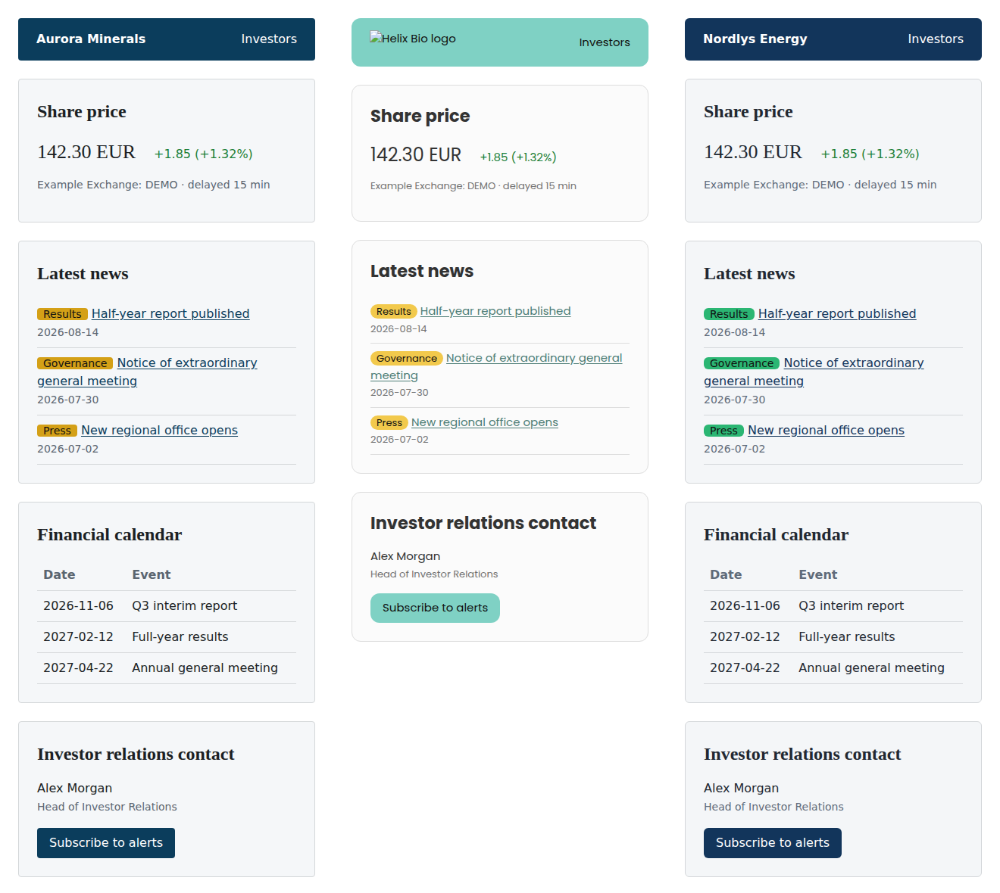
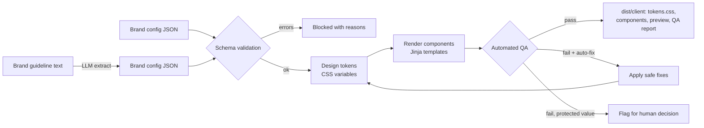

# Brand-to-Code Pipeline

[](https://github.com/barath2211/brand-to-code-pipeline/actions/workflows/tests.yml)  -success)  

> **About this repo:** An open-source reference implementation of a client onboarding automation I designed and built with a colleague at an enterprise SaaS company. It reproduces the approach, not the original code. All brands, content and data here are fictional.

Turn a client's brand guidelines into themed, ready-to-embed web components, with automated QA that explains exactly what to fix.



*Same components, three brands. Middle one (Helix Bio) failed QA on first pass and was auto-repaired.*

## The problem

Onboarding a new client meant styling a set of embeddable components (share price, news, calendar and so on) to match their brand. The old flow:

1. Someone reads the client's brand PDF and hand-applies colours and fonts.
2. The onboarding team reviews the result by eye.
3. Anything off goes back to production. Repeat.

Each loop took days, errors were common (wrong hex, unreadable grey text, http logos), and delivery took **3 to 6 weeks**.

## What this does



1. **Extract** (optional LLM step): free-text guidelines to a structured config. The model only reads; the schema decides if the result is usable.
2. **Validate**: required fields, hex formats, sizes, allowed components.
3. **Tokens**: CSS custom properties, plus derived values (hover shade, accessible text on primary, accessible link shade).
4. **Render**: every component uses tokens only. No literal colours in templates.
5. **QA**: WCAG AA contrast on six text/background pairs, no hard-coded colours, all components present, font fallbacks, https logo, alt text. Optional LLM review compares the result against the original guideline text.
6. **Auto-fix loop**: safe fixes (muted text shade, http to https) are applied and QA re-runs, up to three attempts. Brand identity colours (primary, secondary) are **never** changed automatically; they get a derived accessible shade where needed and a flag for a human.

## Outcome in the original system

Client delivery went from **3 to 6 weeks down to between 2 hours and 2 days**, depending on how complete the client's brand material was. The manual correction loop between production and onboarding mostly disappeared.

## Quick start

```bash
git clone https://github.com/barath2211/brand-to-code-pipeline
cd brand-to-code-pipeline
pip install -r requirements.txt

python src/cli.py build-all --provider mock              # QA fails on Helix Bio (on purpose)
python src/cli.py build-all --provider mock --auto-fix   # repaired, re-checked, passes
open dist/helix-bio/index.html                           # preview
cat dist/helix-bio/qa_report.md                          # what failed and what changed
```

Build straight from guideline text (uses the LLM extraction step):

```bash
LLM_PROVIDER=ollama python src/cli.py build data/brands/nordlys-energy_guidelines.md
```

Provider auto-detection and model config work the same as in my other repos: Ollama, then `ANTHROPIC_API_KEY`, then `OPENAI_API_KEY`, then mock. Models per role are in [`config/models.json`](config/models.json).

## Output per client

```
dist/<client_id>/
  tokens.json, tokens.css     design tokens scoped to .brand-<client_id>
  components.css              shared component styles (variables only)
  components/*.html           one file per component, ready to embed
  index.html                  preview page
  brand.resolved.json         final config after defaults and fixes
  qa_report.md / .json        every check, ratio, and suggested fix
  build_log.json              timings and attempt history
```

## Docs

- [PRD](docs/PRD.md): problem, personas, stories, trade-offs, rollout
- [Architecture](docs/ARCHITECTURE.md): stages, QA rules, fix policy
- [Evals and benchmarks](docs/EVALS_AND_BENCHMARKS.md): what's measured and current results

## Tests

```bash
python -m pytest -q
```

## License

MIT. Built by [Barath Kumar](https://github.com/barath2211).
