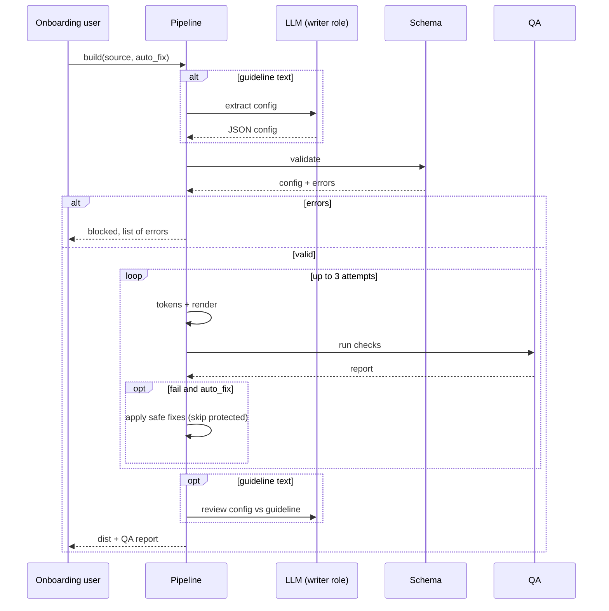

# Architecture

## Stages

| Stage | Module | Deterministic? | Notes |
|---|---|---|---|
| Extract | `extract.py` | No (LLM) | Only for `.md` guideline input. Strict JSON contract. Mock mode uses regex. |
| Validate | `schema.py` | Yes | Blocks the build on any error and lists all of them at once. |
| Tokens | `tokens.py`, `color.py` | Yes | Derives hover, on-primary, on-secondary, link, border and type scale. |
| Render | `pipeline.py` + `templates/` | Yes | Jinja with `StrictUndefined` so a missing field fails loudly. |
| QA | `qa.py` | Yes | Contrast, token-only styling, completeness, fonts, logo, alt text. |
| Review | `qa.py` | No (LLM, optional) | Compares final config to guideline text. Advisory only. |
| Auto-fix | `pipeline.py` | Yes | Applies safe fixes, re-runs QA, max 3 attempts. |

## Sequence

## QA checks

| ID | Check | Rule |
|---|---|---|
| C1 | Body text on background | ≥ 4.5:1 |
| C2 | Muted text on background | ≥ 4.5:1 |
| C3 | Muted text on panels | ≥ 4.5:1 |
| C4 | Text on primary (header, buttons) | ≥ 4.5:1 |
| C5 | Text on secondary (tags) | ≥ 4.5:1 |
| C6 | Links on panels | ≥ 4.5:1 |
| T1 | No literal colours in component HTML | zero matches |
| T2 | All requested components rendered | none missing |
| F1 | Font stacks have fallbacks | comma-separated stack |
| L1 | Logo | https (fail), missing (warn) |
| A1 | Images have alt text | no empty alt |

## Fix policy

| Value | Auto-fix? | How |
|---|---|---|
| `colors.muted_text`, `colors.text` | Yes | Blend toward black/white until 4.5:1 |
| `logo_url` | Yes | http to https |
| `colors.primary`, `colors.secondary` | **No** | Flagged. Derived tokens (`link`, `on-primary`) keep output accessible without changing brand identity |

## Extending

- New component: add `templates/<name>.html.j2` using only `var(--...)`, add the name to `ALLOWED_COMPONENTS`.
- New check: add a function in `qa.py` returning a `Check`; give it a `fix` if it's safe to automate.
